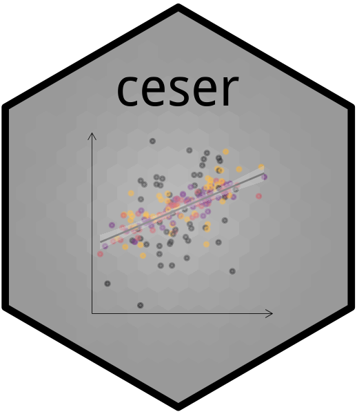

CESER 
===================================================================

[](https://cran.r-project.org/package=ceser)
[](https://travis-ci.org/DiogoFerrari/ceser)

Overview
========

The package provides a function to compute Cluster Estimated Standard Errors (CESE).

For details, see Jackson, John (2020) [Corrected Standard Errors with Clustered Data](https://www.cambridge.org/core/journals/political-analysis/article/corrected-standard-errors-with-clustered-data/F2332E494290725256181955B9BC7428). *Political Analysis*, Volume 28, Issue 3July 2020 , pp. 318-339.


Instalation
===========
From [CRAN](https://cran.r-project.org/web/packages/ceser/index.html)

```
install.packages("ceser")
```

To install the development version (it requires the package "devtools"):

```
devtools::install_github("DiogoFerrari/ceser")

# If you don't want to update the dependencies, use: (you may need to install some dependencies manually)
devtools::install_github("DiogoFerrari/ceser", dependencies=F)
```

Usage
=====

Check the complete documentation [here] (http://www.diogoferrari.com/ceser/) and vignette [here](http://www.diogoferrari.com/ceser/articles/ceser.html).

Here is a simple example (for more information, see =help(ceser)= and =help(vocvCESE)=).

```
library(ceser)

data(dcese)
mod  = lm(enep ~  enpc + fapres + enpcfapres + proximity + eneg + logmag + logmag_eneg , data=dcese)

## --------------------------------------
## Getting the variance covariance matrix
## -------------------------------------- 
## Original variance-covariance matrix (no clustered std. errors)
vcov(mod)

## Variance-covariance matrix using CRSE (sandwish package)
## sandwich::vcovCL(mod, cluster = ~ country)
## sandwich::vcovCL(mod, cluster = ~ country, type="HC3")

## Variance-covariance matrix using CESE
ceser::vcovCESE(mod, cluster = ~ country)
ceser::vcovCESE(mod, cluster = ~ country, type="HC3") # HC3 correction

## ---------
## Summaries
## ---------
## no robust SE 
summary(mod)                                                                          

## summary table using CRSE (sandwich package)
## lmtest::coeftest(mod, vcov = sandwich::vcovCL, cluster = ~ country)                   

## summary using CESE
lmtest::coeftest(mod, vcov = ceser::vcovCESE, cluster = ~ country, type='HC3')

```
